# MNIST-Classification
MNIST Classification using Custom Dataset

# Assignment submitted by MinSeok Yoon
- Seoul National University of Science and Technology, Korea
- Department of Data Science
- Data-Driven User Analysis Lab
#### [Data-Driven User Analysis Lab] (https://ddua.seoultech.ac.kr/index.do)

# Assignment Reports
## Model Architecture Overview

### LeNet-5 Model
LeNet-5 is a convolutional network that includes three convolutional layers and two fully connected layers.

- **Layers**:
  - Convolutional Layer 1: (5×5×1+1)×6 = 156 parameters
  - Convolutional Layer 3: (5×5×6+1)×16 = 2,416 parameters
  - Convolutional Layer 5: (5×5×16+1)×120 = 48,120 parameters
  - Fully Connected Layer 6: (120×84+84) = 10,164 parameters
  - Output Layer: (84×10+10) = 850 parameters
- **Total Parameters**: 61,706

### Custom MLP Model
Our custom MLP model is designed to match the parameter count of LeNet-5 closely, making it suitable for similar tasks with a fully connected architecture.

- **Layers**:
  - First Layer: 784×80+80 = 62,880 parameters
  - Second Layer: 80×20+20 = 1,620 parameters
  - Third Layer: 20×10+10 = 230 parameters
- **Total Parameters**: 64,630

Both models are implemented in PyTorch.

### Comparison
The custom MLP model has a parameter count similar to LeNet-5, with a slightly higher number due to the dense connections in the MLP design. This similarity ensures that our MLP model maintains a comparable capacity and complexity.

For detailed implementation, please refer to `model.py` in this repository.

## Hyperparameter
- Batch size : 64
- Optimizer : SGD
- Learning rate : 0.01
- momentum = 0.9
- Epochs = 15
- Criterion = Cross Entropy Loss
  ### in Normalization
  - weight_decay = 0.001
  - RandomRotation = 10
  - RandomAffine = 0.05, 0.05
  - Dropout = 0.25

## Performance Analysis Report

This report analyzes the performance of two neural network models: the LeNet-5 and a custom Multi-Layer Perceptron (MLP). The performance is measured in terms of accuracy and loss on both the training and testing (used as validation) datasets.

### LeNet-5 Model Performance

#### Training Performance
- Training Accuracy: The model's accuracy on the training set shows a steep increase initially, stabilizing at high values, indicating effective learning.
- Training Loss: Decreases consistently, indicating a strong fit to the training data.

#### Testing Performance
- Testing Accuracy: Remains consistently high, with a peak testing accuracy of approximately 99%, which is characteristic of LeNet-5's performance.
- Testing Loss: Shows a downward trend with some fluctuation, typical in the testing phase due to the varied nature of the test samples.

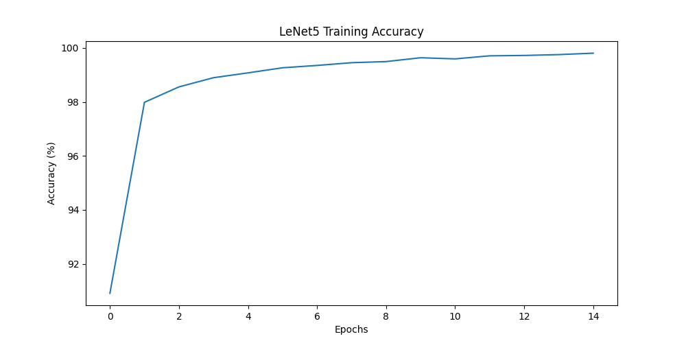
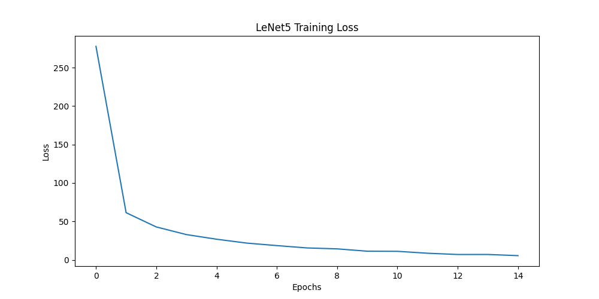
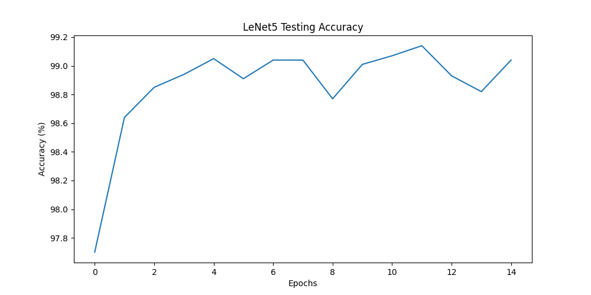
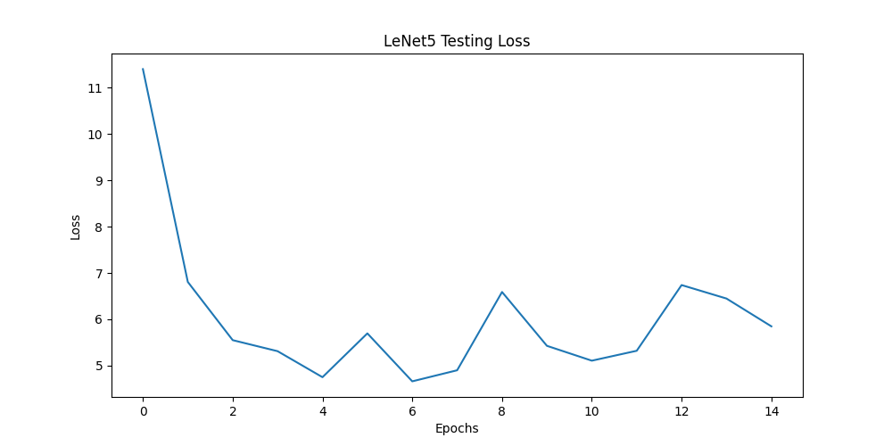

### Custom MLP Model Performance

The Custom MLP model is designed with a similar number of parameters as the LeNet-5 model, and its performance is measured on the MNIST dataset.

#### Training Performance
- Training Accuracy: Shows a similar trend to the LeNet-5, with a slow rise and stabilization.
- Training Loss: The loss decreases rapidly, suggesting that the model is fitting well to the training data.

#### Testing Performance
- Testing Accuracy: Accuracy on the testing set improves consistently, with slight fluctuations, peaking around 97.5%. This suggests good generalization.
- Testing Loss: The testing loss decreases and then fluctuates, which is expected as the model encounters various complexities within the test data.

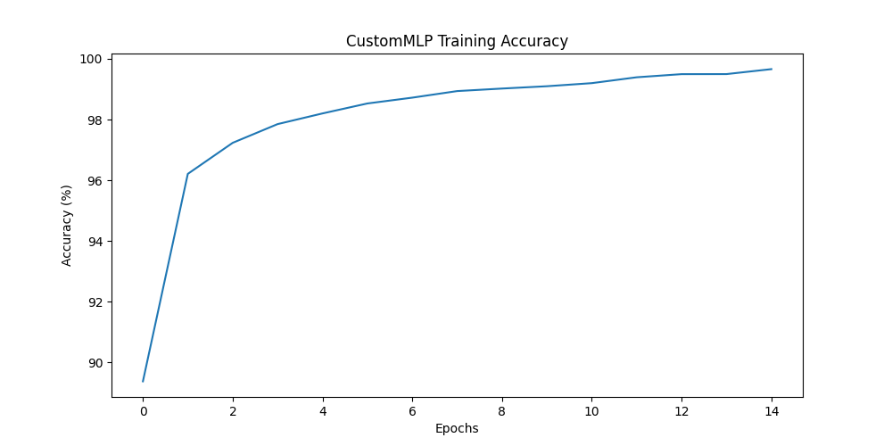
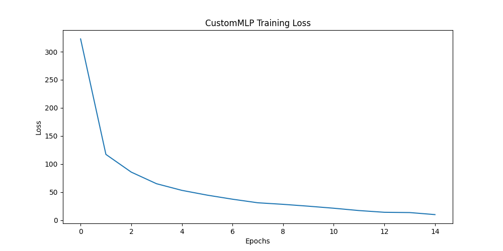
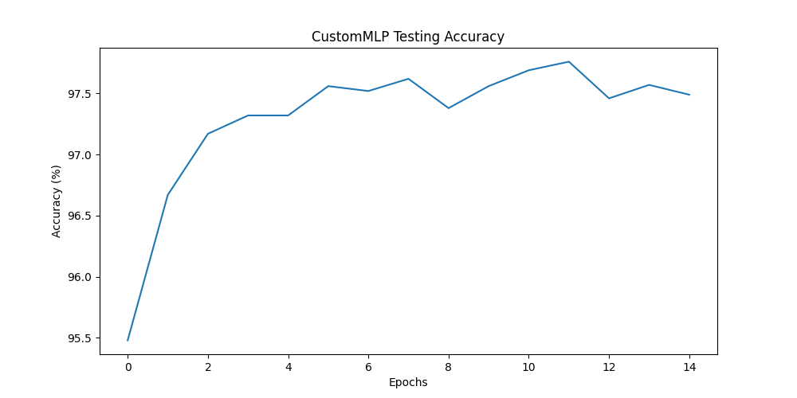
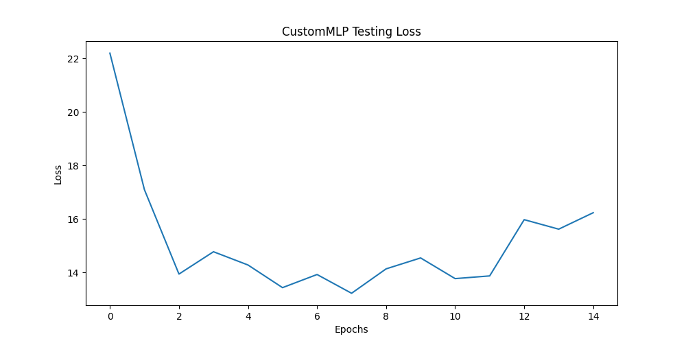

## Comparative Performance Analysis: LeNet-5 vs Custom MLP

This section presents a comparison between the predictive performances of the LeNet-5 and the custom MLP models trained on the same dataset.

### Performance Metrics
evaluate the models based on two primary metrics:
1. **Accuracy**: The proportion of true results (both true positives and true negatives) among the total number of cases examined.
2. **Loss**: A numerical representation of how far the model's predictions are from the actual labels.

### LeNet-5 Model Performance
The LeNet-5 model demonstrates excellent predictive performance with the testing accuracy peaking around 98.9%. This is in line with historical performance metrics known for LeNet-5 on similar datasets. The testing loss for LeNet-5 also shows fluctuations, which is common in testing scenarios due to the model encountering varied difficulty levels within the test data.

### Custom MLP Model Performance
The Custom MLP model shows a steady increase in testing accuracy, reaching approximately 97.5% by the final epoch. This demonstrates strong predictive performance. However, there is some fluctuation in testing loss, indicating variability in the model's predictions on different batches of the test set.

### Comparison and Insights
When comparing the two models:
- **LeNet-5** tends to have a slightly higher **testing accuracy** than the custom MLP, which aligns with expectations given its convolutional structure that is specifically advantageous for image recognition tasks.
- **Testing loss** for both models shows some volatility, which is typical in practice due to the variability inherent in test data.

Overall, both models perform competitively, with LeNet-5 having a slight edge in accuracy. This might be attributed to LeNet-5's convolutional layers, which are adept at capturing spatial hierarchies in image data.

The observed accuracies for both models are similar to known benchmarks, indicating that the training processes were successful and the models are well-tuned for the task.

In conclusion, both the LeNet-5 and custom MLP models demonstrate strong capabilities in recognizing handwritten digits with LeNet-5 showing a slight advantage in overall accuracy.

## Employ regularization techniques 

used three regularization techniques and Through various attempts, I found the following optimal hyperparameters.
- augmentation : RandomRotation(10), RandomAffine(0.05, 0.05) (Rotate images, Moving the images from left to right)
- dropout : Dropout(0.25) to first, second convolution layer
- L2 normalization : optim.weight_decay(0.001)

Here are the four plots of the LeneT-5 model with the normalization technique.

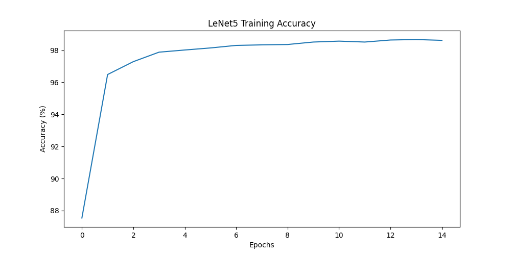
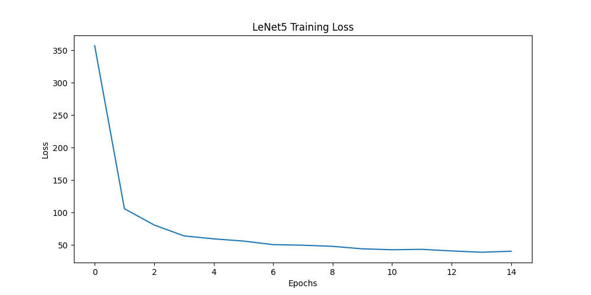
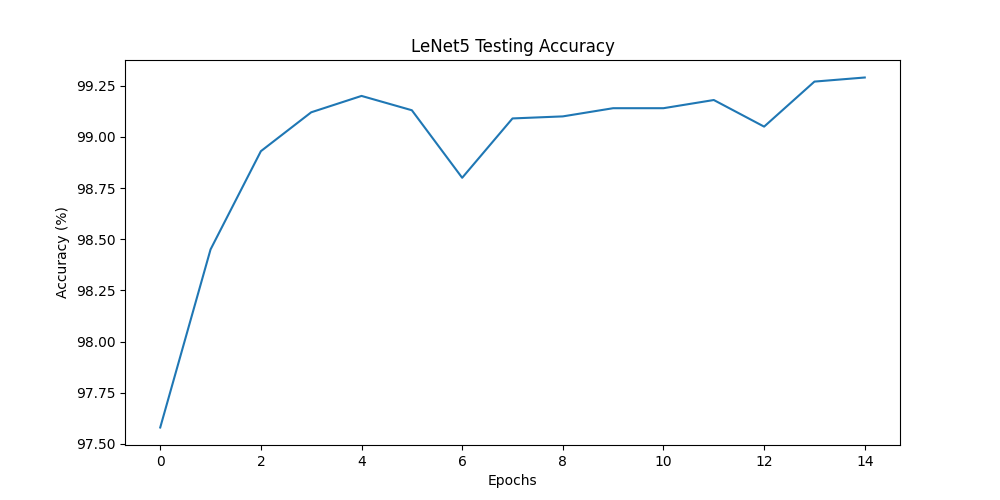
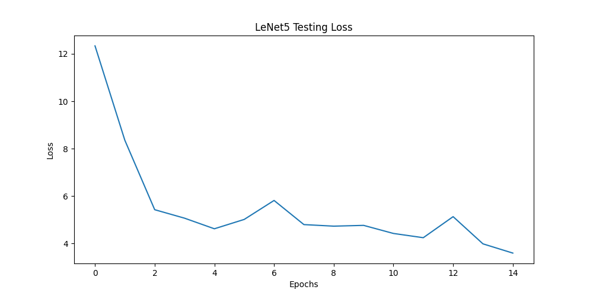

### Conclusion
We confirm that the LeneT-5 Test acuity is slightly elevated from 99.1% to 99.25% as the regularization technique is applied.

By finding the optimal hyperparameters through more experiments, we expect to be able to improve our performance further.
